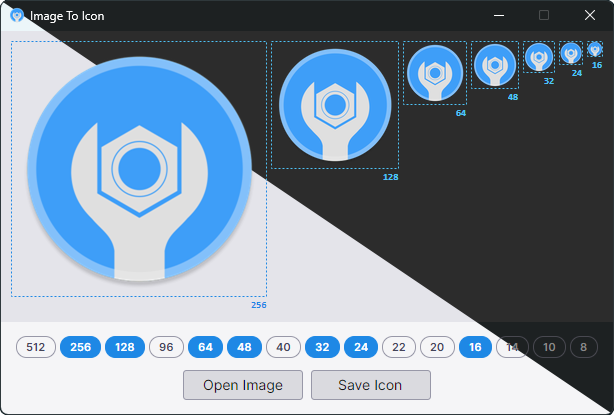

# ImageToIcon

<p align="center">
<a href="https://dotnet.microsoft.com/download"></a>
<a href="https://learn.microsoft.com/dotnet/csharp/"></a>
<a href="https://avaloniaui.net/"></a>
<a href="https://distrochooser.de/"></a>
<a href="LICENSE.txt"></a>
</p>
<p align="center">
<a href="../../issues"></a>
<a href="../../commits/master"></a>
<a href="../../releases/latest"></a>
</p>

**ImageToIcon** is a small cross-platform tool for turning any image into a multi-size Windows `.ico` file. Drop in a single picture and it generates all the standard icon sizes at once, with clean Lanczos downscaling — no wizard, no upsell, no bundle of proprietary editors.

> Every icon workflow used to mean juggling three tools: one to resize, one to compose, one to export. ImageToIcon collapses that into one window and one save button.

---

## Preview (light / dark)
<p align="center"><a href="media/"></a></p>

---

## Features

- Runs natively on Linux and Windows — same binary logic, same output
- Load any common raster format: `PNG`, `JPG`, `BMP`, `TIF`, `GIF`, `WEBP`, `TGA`, `QOI`, `PBM`/`PGM`/`PPM`/`PNM`
- Load `SVG` files directly (rasterised via Skia) and extract icon frames straight from `ICO`, `EXE` and `DLL` files
- Default preset matches the current Windows 11 application icon set (256, 64, 48, 40, 32, 24, 20, 16)
- Freely add, edit or remove custom sizes — any value from 2&nbsp;px up to 4096&nbsp;px, right-click a size to manage it
- High-quality Lanczos-3 resampling for sharp results at every size
- Replace individual sizes manually — swap in a hand-tuned image for 16&nbsp;px or 32&nbsp;px and it gets resized in place to fit the slot
- Drag-and-drop support on the main window and on individual thumbnails
- CLI mode for batch conversion and scripting — process a folder of images in one call
- `PNG`-compressed frames inside the `ICO` container for smaller files, especially at 256&nbsp;px and up

---

## Download

The latest release is available on the [Releases](https://github.com/Si13n7/ImageToIcon/releases/latest) page — no installation required, just extract and run the executable — *ImageToIcon.exe* on Windows, *ImageToIcon* on Linux.

---

## Command Line

ImageToIcon also runs headless. Any invocation containing `--cli` (or `/cli`) skips the UI and processes files directly:

```bash
ImageToIcon --cli --o=./out image1.png image2.jpg
ImageToIcon --cli --o=./out --sizes=16,32,48,256 logo.png
```

| Option | Description |
| --- | --- |
| `--cli`, `/cli` | Run in CLI mode. |
| `--o=DIR`, `/o=DIR` | Output directory for the generated `.ico` files. |
| `--sizes=<list>` | Comma-separated list of icon sizes to generate (2–4096). |
| `--help`, `/?` | Show usage information. |

---

## Requirements

### Linux
- Any modern x64 Linux distribution
- No .NET runtime required — ships as a self-contained single-file executable

### Windows
- Windows 10 or later (x64)
- No additional dependencies — ships as a self-contained single-file executable

---

## Building from Source

### Prerequisites

- [.NET 10 SDK](https://dotnet.microsoft.com/download)

### Build

```bash
# Debug build (default, linux-x64 only)
./build.sh

# Release build (linux-x64 and win-x64)
./build.sh Release
```

### Run directly (without full build)

```bash
cd src/ImageToIcon
dotnet run
```
